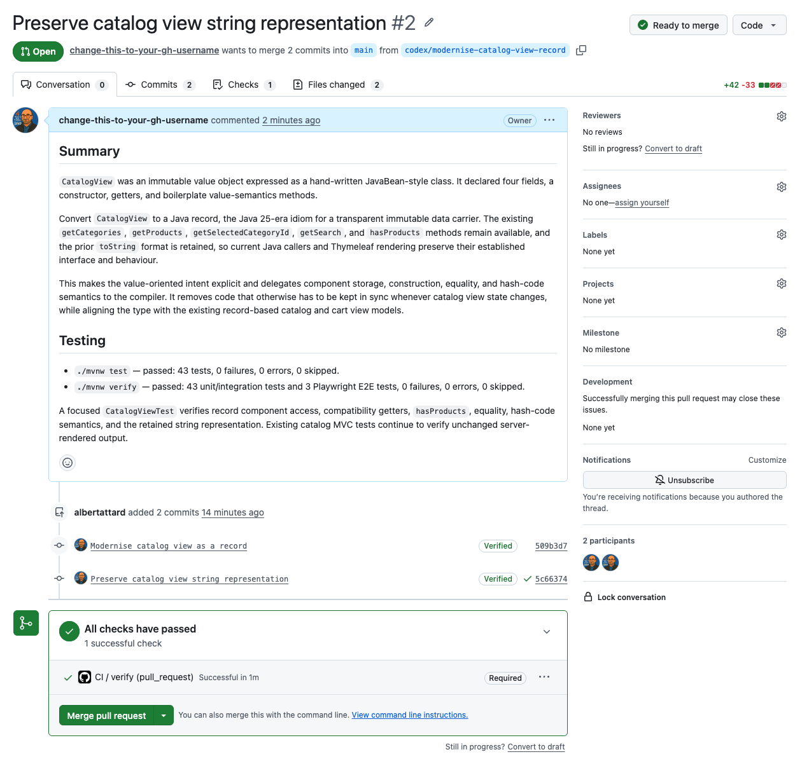

<!-- Generated by Sociable Weaver (https://github.com/albertattard/sw). Manual edits will be overwritten when regenerated. -->

# Demo Supermarket workshop

Work in your fork of `demo-supermarket-starter`. The canonical task files in
`docs/tasks/` are the workshop briefs. Read them, but do not edit them, open
pull requests, push branches, or merge pull requests. All workshop output stays
in your local clone.

This guide is published to the canonical starter repository by the facilitator
after baseline provisioning. It is generated Markdown, not a Sociable Weaver
source file in your clone.

## Prerequisites

You need Java 25 or newer, Git, and an authenticated GitHub CLI session. Your
GitHub account must be able to create a fork of the canonical starter repository.
These checks run when the facilitator publishes this guide; use them as the
required local setup for the workshop.

Java 25 or newer is required to run the application's Maven verification.

Git manages the local branches, worktrees, and commits created during the workshop.

The GitHub CLI creates the attendee fork and clone.

- [Codex CLI](https://developers.openai.com/codex/cli) or equivalent agentic
  tool

## Fork and clone the starter repository

Start by forking the starter project from
[albertattard/demo-supermarket-starter](https://github.com/albertattard/demo-supermarket-starter).
This gives you an independent copy for the workshop.

If you are repeating the workshop, delete the previous fork and its local clone
first. Replace `YOUR-GITHUB-LOGIN` with your GitHub account name. The local
deletion is destructive: run it only from the directory that contains the clone,
never from inside it.

Login to GH if you have not already done so and follow the provided instructions

```shell
gh auth login \
  --hostname github.com \
  --web \
  --git-protocol ssh \
  --skip-ssh-key
```

If already logged in, make sure you are using the right account

```shell
gh auth switch \
  --hostname github.com \
  --user change-this-to-your-gh-username
```

```shell
echo "$(gh api user --jq '.login')"
```

The logged in user

```
change-this-to-your-gh-username
```

Change `git@github.runbook` to the host name you have configured in your `~/.ssh/config`.

```shell
ssh -T git@github.runbook
```

The logged in user

```
Hi change-this-to-your-gh-username! You've successfully authenticated, but GitHub does not provide shell access.
```

```shell
owner="$(gh api user --jq '.login')"
gh api "repos/${owner}/demo-supermarket" --jq '.permissions' | jq
```

TODO: Update caption!

```json
{
  "admin": true,
  "maintain": true,
  "pull": true,
  "push": true,
  "triage": true
}
```

```shell
gh auth status --active --hostname github.com
```

TODO: Update caption!

```
github.com
  ✓ Logged in to github.com account change-this-to-your-gh-username (keyring)
  - Active account: true
  - Git operations protocol: ssh
  - Token: gho_************************************
  - Token scopes: 'delete_repo', 'gist', 'read:org', 'repo'
```

```shell
owner="$(gh api user --jq '.login')"
repository="${owner}/demo-supermarket"

if gh repo view "${repository}" --json nameWithOwner >/dev/null 2>&1; then
  gh repo delete "${repository}" --yes
fi
```

```shell
rm -rf './demo-supermarket'
```

Fork the canonical starter [repository link](https://github.com/albertattard/demo-supermarket-starter), then clone your fork.

```shell
gh repo fork albertattard/demo-supermarket-starter \
  --fork-name demo-supermarket \
  --clone
```

Work in the cloned fork for the remaining application steps.

> Working directory: `demo-supermarket/`

Update `change-this-to-your-gh-username`

```shell
git remote set-url origin git@github.runbook:change-this-to-your-gh-username/demo-supermarket.git
```

Require passing verification and pull requests on `main`.

```shell
gh api repos/change-this-to-your-gh-username/demo-supermarket --jq '.permissions' | jq
```

TODO: Update the caption!

```
{
  "admin": true,
  "maintain": true,
  "pull": true,
  "push": true,
  "triage": true
}
```

TODO: Update the description!

```shell
git remote -v
gh repo view --json nameWithOwner
gh api user --jq .login
```

TODO: Update the caption!

```
origin	git@github.runbook:change-this-to-your-gh-username/demo-supermarket.git (fetch)
origin	git@github.runbook:change-this-to-your-gh-username/demo-supermarket.git (push)
upstream	git@github.com:albertattard/demo-supermarket-starter.git (fetch)
upstream	git@github.com:albertattard/demo-supermarket-starter.git (push)
{"nameWithOwner":"albertattard/demo-supermarket-starter"}
change-this-to-your-gh-username
```

```shell
owner="$(gh api user --jq '.login')"
gh api --method PUT repos/${owner}/demo-supermarket/actions/permissions \
  --field enabled=true
```

```shell
owner="$(gh api user --jq '.login')"
gh api --method PUT "repos/${owner}/demo-supermarket/branches/main/protection" --input - <<'JSON'
{
  "required_status_checks": {
    "strict": true,
    "contexts": [
      "verify"
    ]
  },
  "enforce_admins": true,
  "required_pull_request_reviews": {
    "required_approving_review_count": 0,
    "dismiss_stale_reviews": true,
    "require_code_owner_reviews": false
  },
  "restrictions": null,
  "required_linear_history": false,
  "allow_force_pushes": false,
  "allow_deletions": false,
  "block_creations": false,
  "required_conversation_resolution": true,
  "lock_branch": false,
  "allow_fork_syncing": false
}
JSON
```

## Build the application

```shell
./mvnw clean verify
```

## Understand the project

One especially useful prompt is to make Codex act as an **interactive guide**:

```shell
codex exec \
  --ephemeral \
  --sandbox read-only \
  --output-last-message '/tmp/codex-onboarding-guide.md' \
  - <<'EOF' > '/tmp/codex-onboarding-guide.log' 2>&1
Act as my technical onboarding guide for this repository. Don’t overwhelm me with a complete codebase explanation. First establish the high-level mental model, then take me through one important subsystem at a time. At each stage, point me to specific files to inspect and give me 2–3 questions I should be able to answer from them. When useful, trace actual code paths rather than relying on README documentation.
EOF
```

The model's response

~~~markdown
This is a small, server-rendered Spring Boot supermarket—not a REST API plus SPA.

The high-level mental model is:

```text
Browser
  → Spring MVC controller
  → application service / transaction boundary
  → Spring Data JPA repository
  → in-memory H2 database
  → view model
  → Thymeleaf HTML response
```

A few important constraints:

- `catalog` is read-heavy: filtering, searching, sorting, and presenting products.
- `cart` owns guest-cart creation and mutations. A cart is identified by a token embedded in the URL, not by a login, session, or cookie.
- Thymeleaf renders full pages; HTMX selectively replaces fragments during cart mutations.
- Flyway owns the schema and seed data. Hibernate only validates it.
- The database is in-memory, so application restarts discard carts.
- The package boundary is pragmatic rather than strict: catalog depends on cart state, and cart sometimes asks catalog for presentation data.

The likely onboarding sequence is catalog → cart domain and persistence → HTMX response handling → error/security boundaries → test strategy.

## Stage 1: Trace catalog browsing

Start with this actual request:

```text
GET /products?category=6&q=tomatoes
```

Inspect these files in order:

1. [CatalogController.java](/private/tmp/demo-supermarket/src/main/java/demo/supermarket/catalog/CatalogController.java:21)  
   Finds the HTTP entry points and places one `CatalogView` in the model.

2. [CatalogService.java](/private/tmp/demo-supermarket/src/main/java/demo/supermarket/catalog/CatalogService.java:19)  
   Normalizes input, escapes SQL wildcard characters, queries categories/products, and converts entities into presentation objects.

3. [ProductRepository.java](/private/tmp/demo-supermarket/src/main/java/demo/supermarket/catalog/ProductRepository.java:12)  
   Contains the real filtering and ordering rules. Notice the `join fetch`: that matters because open-in-view is disabled.

4. [CatalogProduct.java](/private/tmp/demo-supermarket/src/main/java/demo/supermarket/catalog/CatalogProduct.java:5) and [CatalogView.java](/private/tmp/demo-supermarket/src/main/java/demo/supermarket/catalog/CatalogView.java:5)  
   These are deliberately separate from JPA entities. Formatting and fallback-image behavior live here.

5. [catalog.html](/private/tmp/demo-supermarket/src/main/resources/templates/catalog.html:39)  
   Follow how `catalog.search`, `catalog.categories`, and `catalog.products` become HTML. Stop around line 80 for now; the later cart controls belong to the next subsystem.

6. [CatalogControllerTest.java](/private/tmp/demo-supermarket/src/test/java/demo/supermarket/catalog/CatalogControllerTest.java:37)  
   This is a concise executable specification of visibility, filtering, ordering, and empty-state behavior.

The code path is:

```text
CatalogController.catalog()
  → CatalogService.findCatalog()
    → CategoryRepository.findByActiveTrueOrderByNameAsc()
    → ProductRepository.findActiveCatalogProducts(6, "%tomatoes%")
    → CatalogView
  → catalog.html
  → HTTP 200 HTML
```

Questions you should be able to answer:

1. Why does `q=%` search for a literal percent sign instead of matching every product?
2. Which layer guarantees that inactive products and products in inactive categories remain hidden?
3. Why would removing `join fetch product.category` be risky when `spring.jpa.open-in-view` is `false`?

One candid architectural observation: `CatalogService.findActiveProduct()` throws a bare `NoSuchElementException`, while cart lookup uses domain-specific exceptions. That inconsistency is worth remembering; it may become an error-handling defect as the application grows.

Once you’ve traced this path, send me your answers—or simply say “next”—and we’ll move to guest-cart creation and persistence.
~~~

A good way to use Codex for onboarding is to move from **map → architecture → execution → deep dive → contribution**. These prompts are designed so Codex can inspect the repository rather than just explain concepts generically.

1. **Get the 10-minute overview**

   > Give me a practical onboarding overview of this repository. Explain what the project does, who/what consumes it, the major components, the main technologies/frameworks, and how the pieces fit together. Point me to the 5–10 files or directories I should understand first, and explain why each matters.

2. **Build a mental model of the architecture**

   > Analyze this codebase and explain its architecture to a new engineer. Identify the major modules/services/layers, their responsibilities, dependencies between them, important interfaces, and where state/data is stored. Trace one representative request or workflow end-to-end through the system.

3. **Explain the repository structure**

   > Walk me through the repository structure. For each important top-level directory, explain its purpose, what kinds of code live there, and whether I need to understand it immediately or can ignore it initially. Highlight generated code, third-party code, configuration, tests, build tooling, and deployment infrastructure.

4. **Figure out how to run it**

   > Determine how I can build and run this project locally from a clean checkout. Inspect the repository rather than guessing. Give me the commands in order, explain prerequisites and environment variables, and point to the files where you found this information. Also explain how to run the tests and common developer workflows.

5. **Find the important entry points**

   > Identify the main entry points into this application. Show me where execution starts and trace what happens during startup. Then identify the main runtime paths an engineer working on this project is likely to encounter.

6. **Teach me the domain**

   > Teach me the domain model behind this project using the code as evidence. What are the most important concepts, entities, abstractions, and terminology? For each concept, point me to representative classes/files/functions. Explain relationships between them in plain English.

7. **Understand the data flow**

   > Pick one important user action/API operation/workflow and trace it end-to-end through the codebase. Start at the external entry point and follow it through validation, business logic, persistence/external calls, and the response. Include file names and key functions/classes at each step.

8. **Understand the tests**

   > Explain the testing strategy of this repository. Identify the test frameworks, unit/integration/end-to-end tests, fixtures and mocks, and how tests are organized. Show me 3 representative tests that would teach me the most about how this system is intended to behave.

9. **Find the risky/complex parts**

   > Analyze the repository and identify the 5 areas that are hardest or riskiest for a new engineer to modify. For each, explain why it is complex, what assumptions or invariants I should understand, what tests protect it, and what mistakes a newcomer could easily make.

10. **Give me an onboarding curriculum**

   > Create a 2-hour onboarding plan for this repository. Assume I’m a new engineer who needs to become productive quickly. Give me an ordered sequence of files, concepts, and code paths to study. For each step, tell me what question I should be able to answer before moving on. Avoid making me read the entire repository.

## Create the `AGENTS.md` file

Create the `AGENTS.md` file

You can use the following TUI slash command when working with the OpenAI Codex desktop application

> /init

The TUI slash command does not work from the command line. Therefore, you need to be a bit more prescriptive.

```shell
codex exec \
  --ephemeral \
  --sandbox workspace-write \
  --output-last-message '/tmp/codex-create-agents_md-file.md' \
  - <<'EOF' > '/tmp/codex-create-agents_md-file.log' 2>&1
Create a concise `AGENTS.md` in the repository root with durable guidance for future agents. Keep it specific to this Java/Maven/Spring Boot application. Do not change any other files. Do not only describe the file: create it. Finally, verify that `AGENTS.md` exists.
EOF
```

The newly created `AGENTS.md` file

```markdown
# Repository Guide

## Project shape

- This is a Java 25, Maven Wrapper, Spring Boot 4.1 application. Use `./mvnw`, not a globally installed Maven.
- Production code lives under `src/main/java/demo/supermarket`, grouped by feature (`catalog`, `cart`, `security`). Keep new code in the owning feature package.
- The UI is server-rendered with Spring MVC, Thymeleaf, and HTMX. Templates are in `src/main/resources/templates`; static assets are in `src/main/resources/static`.
- Persistence uses Spring Data JPA and Flyway against H2 in PostgreSQL compatibility mode. Schema migrations live in `src/main/resources/db/migration`.

## Change guidelines

- Preserve the existing controller -> service -> repository separation. Keep business rules in services rather than controllers or templates.
- Prefer focused changes that follow the surrounding Java style; do not introduce frameworks, abstractions, or dependencies without a concrete need.
- Treat committed Flyway migrations as immutable. Add the next versioned migration for schema or seed-data changes, and keep JPA mappings consistent with it.
- Keep public routes and access rules aligned with `SecurityConfiguration`; add security coverage when exposing a new endpoint.
- Do not edit generated content under `target/` or checked-in product images unless the task explicitly requires it.

## Verification

- Put tests under the matching package in `src/test/java`; use focused MVC/service tests for behavior close to the change.
- Run a focused test while iterating: `./mvnw test -Dtest=ClassName`.
- Run the unit/integration suite before handoff: `./mvnw test`.
- Run `./mvnw verify` when changing browser-visible flows or the end-to-end harness. This runs Playwright-tagged tests and may install Chromium.
- If verification cannot run, report the exact command and blocker; do not claim success from compilation alone.
```

Commit the changes once ready

```shell
# Create and switch to a branch for this change.
git switch --create '004-create-agents_md-file'

# Commit all changes.
git add .
git commit --message 'Create AGENTS.md file' \
           --message 'Add repository guidance for coding agents'

# Push this branch to GitHub and set its remote tracking branch.
git push --set-upstream origin '004-create-agents_md-file'

# Create the pull request and save its link for the merge helper.
owner="$(gh api user --jq '.login')"
pr_url_file='target/pr-004-create-agents_md-file.log'
gh pr create \
  --repo "${owner}/demo-supermarket" \
  --base main \
  --head '004-create-agents_md-file' \
  --title 'Create AGENTS.md file' \
  --body 'Add repository guidance for coding agents' > "${pr_url_file}"
cat "${pr_url_file}"

# Wait for required checks, then merge without bypassing branch policy.
./tools/merge-pull-request.sh "${pr_url_file}"
rm -f "${pr_url_file}"
```

## Using Agents

TODO: Update description!

```shell
codex exec \
  --ephemeral \
  --sandbox workspace-write \
  --output-last-message '/tmp/codex-modernisation-task.md' \
  - <<'EOF' > '/tmp/codex-modernisation-task.log' 2>&1
Find exactly one worthwhile Java modernisation opportunity in this codebase and implement it in a focused commit.

Constraints:
  - Keep the project on Java 25. Do not lower the Java version or alter the runtime/toolchain baseline.
  - Look for code that is unnecessarily Java-8-style or older in expression: for example mutable JavaBean-style value objects, boilerplate equals/hashCode/toString, manual collection processing, nullable control flow, or verbose conditional logic.
  - Choose one cohesive opportunity only. Do not perform a broad refactor or mix unrelated cleanup into the change.
  - Preserve observable behaviour, public routes, persistence behaviour, and existing test intent.
  - Prefer a clear Java 25-era idiom when it materially improves the code. Do not modernise merely for novelty.
  - Add or adjust tests where needed to prove the behaviour remains correct.
  - Do not overwrite, revert, stage, or commit unrelated existing changes.

Process:
  1. Inspect the codebase and identify the best single candidate.
  2. Briefly explain the candidate and the intended modernisation before editing.
  3. Create a branch named `codex/modernise-<short-description>`.
  4. Implement the focused change and commit it with a clear message.
  5. Run `./mvnw test` and `./mvnw verify`; fix any failures caused by your change.
  6. Review the final diff for scope and correctness.
  7. Write the proposed pull-request description to
     `target/codex-modernisation-pr.md`. It must state:
     - the legacy-style code found;
     - the Java 25 idiom adopted;
     - why the change improves maintainability;
     - the test commands run and their results.

Do not run `git push` or `gh pr create`. Stop after the local commit and writing the pull-request description.
EOF

branch="$(git branch --show-current)"
case "$branch" in
  codex/modernise-*) ;;
  *)
    echo "Expected a codex/modernise-* branch, but found: $branch" >&2
    exit 1
    ;;
esac

if [ ! -s 'target/codex-modernisation-pr.md' ]; then
  echo 'The agent did not create a pull-request description.' >&2
  exit 1
fi

git push --set-upstream origin "$branch"

repository="$(git remote get-url origin | sed -E 's#^.*[:/]([^/]+/[^/]+)\.git$#\1#')"
title="$(git log -1 --format=%s)"

gh pr create \
  --repo "$repository" \
  --base main \
  --head "$branch" \
  --title "$title" \
  --body-file 'target/codex-modernisation-pr.md'
```

Review the PR



This can be easily captured in a script and executed on a scheduler.
