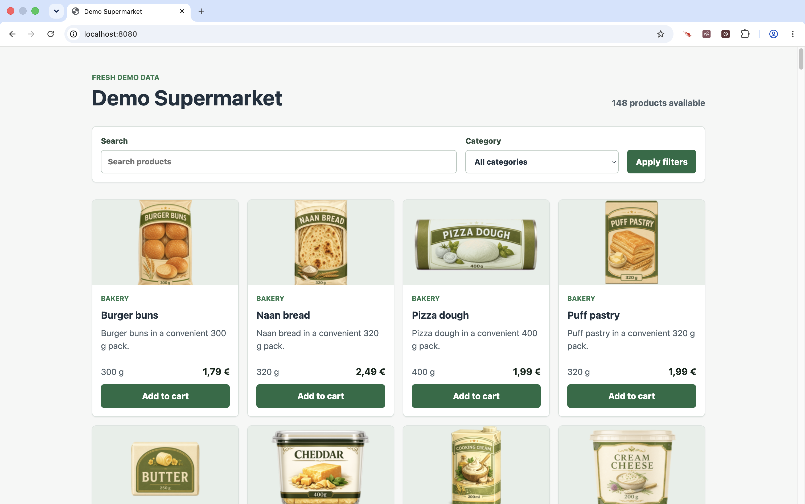

<!-- Generated by Sociable Weaver (https://github.com/albertattard/sw). Manual edits will be overwritten when regenerated. -->

# Building a Java feature with Codex: Demo Supermarket workshop

Learn a practical, evidence-led workflow for using Codex while delivering a
small Java change. You will clone `demo-supermarket-starter`, use Codex to
inspect the codebase and assess `TASK-004`, establish layered `AGENTS.md`
guidance, and implement and verify the task.

Codex is a collaborator in this workshop: it can inspect the repository,
propose changes, help make a task ready, and pass structured findings between
steps. You remain responsible for the engineering decisions and for accepting
the evidence.

---

## Disclaimer

The examples provided in this repository are for **educational purposes only**
and are intended to be used **exclusively within this workshop**. While every
effort has been made to ensure accuracy and reliability, these examples are
provided **“as is”**, without any warranties, express or implied.

By using these examples, you acknowledge that you do so **at your own risk**.
The authors and contributors shall **not be held liable** for any direct,
indirect, incidental, or consequential damages resulting from the use, misuse,
or inability to use these examples.

It is the responsibility of the user to **review, test, and validate** any code
before applying it in a production or commercial environment.

### Performance Disclaimer

The performance values shown in this workshop are for reference only and should
not be treated as absolute. Results can vary depending on hardware, system
configuration, runtime environment, and other factors. Readers are encouraged to
conduct their own tests under controlled conditions to obtain accurate
measurements relevant to their specific use case.

---

## Learning objectives

By the end of this workshop, you can:

- establish a healthy baseline for a Java/Maven repository before asking an
  agent to change it;
- create and use cascading `AGENTS.md` files to give repository-wide and
  narrower task-specific guidance to Codex;
- inspect a codebase and assess `TASK-004` with Codex, recording the decisions
  needed to make the task ready;
- create or apply a focused project skill and use a structured output from one
  agent step as input to the next; and
- create or apply a focused project skill, pass structured output from one agent
  step to the next, and configure a bounded automation that makes one scoped
  change, verifies it, and opens a pull request for human review; and
- review a diff and Maven verification result to decide whether the proposed
  change is acceptable.

## Prerequisites and environment

You need Java 25 or newer, Git, `curl`, and the Codex CLI in a macOS or Linux
environment with a Bash-compatible shell. The starter repository is public and
this core workshop works entirely in a local clone, so it does not require a
GitHub account or the GitHub CLI. Internet access is required to clone the
repository and use Codex.

- [Oracle Java 25](https://www.oracle.com/java/technologies/downloads/#java25)
  or newer is required to run the application’s Maven verification.

- Git manages the local branches, worktrees, and commits created during the
  workshop.

- `curl` checks that the application has started successfully.

- [Codex CLI](https://developers.openai.com/codex/cli) or equivalent agentic
  tool

## Repository and workflow design

This workshop uses the Demo Supermarket Java application as a realistic project
context for learning how to work with Codex in day-to-day engineering.

You will begin with an unfamiliar repository, establish a baseline, add
cascading `AGENTS.md` guidance, inspect the codebase, create and use skills,
assess a task brief, and review evidence produced by agent-assisted work.
`TASK-004` is the worked example used to demonstrate task readiness and an
implementation workflow; it is not the sole subject of the workshop.

**Agent inputs:** Repository instructions, `AGENTS.md` files, code and tests,
task briefs, project skills, and structured findings from earlier agent steps.

**Evidence:** Command output, task-readiness records, agent summaries, diffs,
Maven verification, and—where the automation exercise is used—a pull request for
human review.

**Human decision:** Decide whether the instructions, task, proposed change, and
verification evidence are sufficient to proceed or accept the work.

**Limits:** Codex can assist with engineering, task grooming, and bounded
automation. It does not establish correctness, security, production readiness,
or merge approval.

## Clone the starter repository

Clone the Demo Supermarket starter repository. All workshop work stays in this
local clone.

Run this from a directory where you want the `demo-supermarket` folder created.
If that folder already exists, use a different empty directory or delete it
first.

```shell
git clone https://github.com/albertattard/demo-supermarket-starter.git \
  demo-supermarket
```

Work in this local clone for the remaining workshop steps.

> Working directory: `demo-supermarket/`

```shell
git log --oneline --decorate -5
```

The five most recent commits in the starter repository. Stop and seek help if
this does not look like the expected Demo Supermarket history.

```
af46349 (HEAD -> main, origin/main, origin/HEAD) Merge pull request #3 from albertattard/003-persisted-guest-cart
ec4d5ca Implement persisted guest carts
65cef5a Merge pull request #2 from albertattard/002-seed-catalog-and-product-listing
218f4c0 Seed catalog categories and products
69de50a Merge pull request #1 from albertattard/001-project-foundation
```

## Build the application

Before asking Codex to inspect or change the code, establish that this clone
builds, tests, and starts successfully on your machine. This baseline separates
pre-existing environment or application failures from any later agent-assisted
change. Stop and resolve a failure in this section before continuing.

1. **Build and verify the application.**

   The Maven Wrapper compiles the project and runs its verification suite. The
   first run may take longer while Maven downloads dependencies.

   ```shell
   ./mvnw clean verify
   ```

   **Optional: inspect the build artefacts.** Confirm that the Spring Boot
   executable JAR was created before starting the application.

   ```shell
   tree --dirsfirst --sort=name --prune -L 1 'target'
   ```

   The executable Spring Boot JAR and the original JAR retained before Spring
   Boot repackages it. The executable JAR includes the application and its
   runtime dependencies.

   ```
   target
   ├── demo-supermarket-1.0.0.jar
   └── demo-supermarket-1.0.0.jar.original

   1 directory, 2 files
   ```

2. **Run the application locally.**

  This starts the executable JAR in the background, writes its output to
  `target/application.log`, and records its process ID for the stop step. If it
  exits immediately, inspect that log before continuing.

   ```shell
   java -jar './target/demo-supermarket-1.0.0.jar' > './target/application.log' 2>&1 &

   # Save the PID so later steps can reuse it after this entry finishes.
   echo "$!" > './target/application.pid'
   ```

   Wait for the application to start. This checks the home page for up to one
   minute. If it does not return HTTP 200, inspect the application log and
   resolve the problem before continuing.

   ```shell
   for attempt in {1..60}; do
     status="$(curl --silent --output /dev/null --write-out '%{http_code}' \
       'http://localhost:8080/' 2>/dev/null || true)"

     if [ "${status}" = '200' ]; then
       exit 0
     fi

     sleep 1
   done

   echo 'The application did not respond with HTTP 200 within one minute.' >&2
   tail -n 100 './target/application.log' || true
   exit 1
   ```

3. Access the application

   Open [localhost:8080](http://localhost:8080) in a browser and explore the
   application. This is a manual smoke test: confirm that the application loads
   and that its basic navigation works before moving on to agent-assisted work.

   

4. Stop the application

   Stop the local process when you have finished the smoke test. This removes
   the PID file.

   ```shell
   kill "$(cat './target/application.pid')"
   rm -f './target/application.pid'
   ```

## Understand the project

This is your first read-only Codex exercise. Use it to form a working mental
model of the repository before asking an agent to change it. Codex can identify
useful starting points, but its response is evidence to inspect—not an
authoritative description of the application.

A prompt is the instruction that frames Codex’s work. A short request can be
enough for a simple question, but ambiguous requests often produce broad or
generic answers. Pausing to state the **goal**, **lens**, **boundaries**, and
expected **output** helps Codex focus on the decision you need to make rather
than trying to explain everything it can find.

This structure also helps you clarify your own request. Instead of discovering
halfway through that you wanted a plan rather than an explanation, or evidence
rather than a suggestion, you make those expectations explicit before the work
begins. It will not eliminate useful follow-up questions, but it reduces
avoidable back-and-forth and makes the response easier to assess: you can see
whether Codex stayed within scope, used repository evidence, and returned
something that supports your next decision.

1. Ask Codex to guide your initial exploration. It must not modify files,
   branches, or task briefs.

   The command below runs Codex non-interactively against the current
   repository. The prompt defines the work; the command options define the
   execution environment.

   - `--ephemeral` keeps this exploratory session out of persistent local
     session history.
   - `--sandbox read-only` lets Codex inspect the repository but prevents
     model-generated shell commands from modifying it. This is an enforced
     guardrail: it protects the repository even if a prompt mistakenly asks
     Codex to create or edit files.
   - `--model 'gpt-5.6-luna'` selects an efficient model suited to
     cost-sensitive, high-volume work. `model_reasoning_effort="low"` asks it to
     spend less time reasoning before responding. For this bounded, read-only
     onboarding exercise, that is a deliberate trade-off: we need a useful
     starting map of the repository, not an exhaustive architectural assessment.
     A more capable model or higher reasoning effort can be appropriate for
     difficult implementation, investigation, or review work. They can also
     increase latency and cost without improving a straightforward task. Start
     with the least expensive configuration that produces useful evidence, then
     increase capability or reasoning effort only when the task and results
     justify it.
   - `--output-last-message` tells the Codex harness, not the model, to save
     Codex’s final response to a file. This does not give the model permission
     to modify the repository; the read-only sandbox still prevents
     model-generated commands from changing it. The saved response lets the
     workshop display and discuss the result as evidence.

   ```shell
   codex exec \
     --ephemeral \
     --sandbox read-only \
     --model 'gpt-5.6-luna' \
     --config 'model_reasoning_effort="low"' \
     --output-last-message '/tmp/codex-onboarding-guide.md' \
     - <<'EOF' > '/tmp/codex-onboarding-guide.log' 2>&1
   Goal
   Build a practical mental model of this Java application before making changes.

   Lens
   Act as a technical onboarding guide and codebase investigator.

   Boundaries
   Inspect the repository only. Do not modify files. Do not attempt a complete
   codebase tour. Base claims on specific files and identify anything you cannot
   verify. When citing files, use paths relative to the repository root, such as
   `src/main/java/demo/supermarket/SupermarketApplication.java`. Never use absolute
   paths, temporary-directory paths, or local-file links.

   Output
   - what the application does and how to verify it locally;
   - where feature code, configuration, data, and tests live, with
     repository-relative file references;
   - the current work visible in the repository and a safe first contribution to
     explore;
   - a focused 90-minute onboarding plan; and
   - repository conventions plus questions only the team can answer.
   EOF
   ```

2. Review Codex’s response.

   ~~~markdown
   ## Application model

   This is a server-rendered Spring Boot grocery catalogue with persisted guest carts.

   The verified implemented flow is:

   1. `GET /` or `GET /products` renders the active catalogue.
   2. Users can filter by category or search product name/description.
   3. `POST /cart/start` creates a cart with an opaque token, optionally adding a product.
   4. Cart operations add, update, or remove products.
   5. Thymeleaf renders full pages; HTMX requests receive HTML fragments.
   6. H2 stores data in memory, and Flyway creates/seeds the schema at startup.

   The main request path is:

   `CatalogController` → `CatalogService` → JPA repositories → Thymeleaf templates

   Cart mutations follow:

   `CartController` → `CartService` → locked persisted `Cart`/`CartItem` entities → rendered page or HTMX fragment.

   Relevant files:

   - `src/main/java/demo/supermarket/SupermarketApplication.java`
   - `src/main/java/demo/supermarket/catalog/CatalogController.java`
   - `src/main/java/demo/supermarket/catalog/CatalogService.java`
   - `src/main/java/demo/supermarket/cart/CartController.java`
   - `src/main/java/demo/supermarket/cart/CartService.java`
   - `src/main/resources/templates/catalog.html`
   - `src/main/resources/templates/cart.html`

   One important pushback: the README describes placing orders, pickup/delivery, logistics workflows, and inventory management, but I found no corresponding order, fulfillment, or inventory implementation in this checkout. Those descriptions appear aspirational or belong to future work; they are not verified application behavior.

   ## Running and verifying locally

   The project requires Java 25 and Maven 3.6.3 or later, as specified in `pom.xml`.

   Useful checks:

   ```bash
   ./mvnw test
   ```

   Runs the default test suite; E2E tests are excluded by Surefire.

   ```bash
   ./mvnw spring-boot:run
   ```

   Then open:

   ```text
   http://localhost:8080/
   ```

   For the browser journey:

   ```bash
   ./mvnw verify
   ```

   This invokes the Playwright E2E setup and uses port `18080` for the E2E server. The repository requires a locally available Chromium installation or permission to install it through the configured Maven lifecycle.

   The health endpoint is:

   ```text
   http://localhost:8080/actuator/health
   ```

   Security is permissive for the customer routes, cart routes, static assets, and health endpoint. Other routes require HTTP Basic authentication, although no internal authenticated feature routes were found.

   ## Code, configuration, data, and tests

   Feature code is grouped by package rather than by technical layer:

   - Catalogue: `src/main/java/demo/supermarket/catalog/`
   - Guest carts: `src/main/java/demo/supermarket/cart/`
   - Security: `src/main/java/demo/supermarket/security/SecurityConfiguration.java`
   - Application entry point: `src/main/java/demo/supermarket/SupermarketApplication.java`

   Configuration:

   - `src/main/resources/application.yml`
   - `pom.xml`

   The application uses:

   - Spring MVC and Thymeleaf
   - Spring Data JPA
   - Flyway
   - H2 in-memory PostgreSQL-compatible mode
   - Spring Security
   - HTMX
   - Playwright for E2E tests

   Database schema and seed data live in:

   - `src/main/resources/db/migration/V1__baseline.sql`
   - `src/main/resources/db/migration/V2__catalog.sql`
   - `src/main/resources/db/migration/V3__guest_carts.sql`
   - `src/main/resources/db/migration/V4__product_slugs.sql`

   `V2__catalog.sql` seeds the categories and products. `V3__guest_carts.sql` defines cart persistence, quantity constraints, and uniqueness constraints. `V4__product_slugs.sql` adds stable product identifiers.

   Tests are split into:

   - Controller/integration tests:
     - `src/test/java/demo/supermarket/catalog/CatalogControllerTest.java`
     - `src/test/java/demo/supermarket/cart/CartControllerTest.java`
     - `src/test/java/demo/supermarket/security/PublicRoutesTest.java`
   - Service and concurrency tests:
     - `src/test/java/demo/supermarket/catalog/CatalogServiceTest.java`
     - `src/test/java/demo/supermarket/cart/CartServiceConcurrencyTest.java`
     - `src/test/java/demo/supermarket/cart/CartServiceTokenRetryTest.java`
   - Browser tests:
     - `src/test/java/demo/supermarket/e2e/HomePageTest.java`
     - `src/test/java/demo/supermarket/e2e/harness/`

   ## Current repository work

   The worktree is clean. `HEAD` is `af46349`, which is a merge commit for persisted guest carts. Recent history shows:

   - project foundation
   - seeded catalogue and product listing
   - persisted guest carts

   There are no visible uncommitted changes to preserve.

   A safe first contribution would be a small, well-tested improvement to catalogue behavior—for example, clarify or improve the empty-search/filter experience. It would touch a narrow surface:

   - `CatalogService.java`
   - `CatalogControllerTest.java`
   - possibly `catalog.html`

   Before choosing that contribution, I would avoid implementing the README’s order or logistics claims without a team decision: those are materially larger features, not obvious missing pieces in the current cart implementation.

   ## Focused 90-minute onboarding plan

   0–10 minutes: establish the baseline

   - Read `README.md`, `pom.xml`, and `application.yml`.
   - Run `git status --short`.
   - Run `./mvnw test`.
   - Record whether the local environment supports Java 25 and Maven.

   10–30 minutes: trace catalogue browsing

   - Read `CatalogController.java`.
   - Read `CatalogService.java`.
   - Inspect `ProductRepository.java` and `CategoryRepository.java`.
   - Follow the data into `catalog.html`.
   - Verify home page, category filtering, search, inactive-product exclusion, and empty results through `CatalogControllerTest.java`.

   30–55 minutes: trace cart lifecycle

   - Read `CartController.java`.
   - Read `CartService.java`, `Cart.java`, `CartItem.java`, and `CartRepository.java`.
   - Inspect `V3__guest_carts.sql`.
   - Follow one flow: start cart → add item → update quantity → remove item.
   - Compare normal requests with HTMX requests using `CartControllerTest.java`.

   55–70 minutes: understand browser behavior

   - Read `HomePageTest.java` and the relevant E2E harness classes.
   - Run the E2E suite only if Chromium and the environment are available.
   - Note that the E2E configuration uses a separate fixed port, `18080`.

   70–82 minutes: inspect repository conventions

   - Check package-private controllers/entities and public service methods.
   - Observe migration-first persistence changes.
   - Observe that tests assert rendered HTML and redirects, not only service return values.
   - Review security route allowlisting in `SecurityConfiguration.java`.

   82–90 minutes: choose a first task

   Write down:

   - the exact user-visible behavior to change;
   - the controller/service/template boundary involved;
   - one existing test to extend;
   - one new observable test assertion;
   - the stop condition if the desired behavior conflicts with an undocumented domain rule.

   ## Conventions and unresolved questions

   Observed conventions:

   - Package by feature: `catalog`, `cart`, and `security`.
   - Controllers return Thymeleaf views or redirects.
   - Services own business rules and map entities to view records.
   - Database changes use numbered Flyway migrations.
   - Product identity in URLs uses slugs, not database IDs.
   - Cart quantities are constrained to 1–99 in both Java and SQL.
   - Cart mutations use locking queries for concurrency safety.
   - HTMX support is explicit through the `HX-Request` header.
   - Tests commonly verify status, redirects, and rendered HTML.
   - The application deliberately uses an in-memory database, so data disappears on restart.

   Only the team can answer:

   - Are orders, fulfillment, logistics, and inventory intentionally future scope, or is this checkout incomplete?
   - What is the intended roadmap after guest carts?
   - Should internal workflows eventually use real authentication and roles, or is Basic authentication only a placeholder?
   - Should cart tokens expire, be cancellable, or be converted into orders?
   - Is H2-only persistence intentional for workshops, or should production-like database support be added?
   - What are the intended delivery areas, fees, and order lifecycle states?
   - Which first contribution is valuable to the workshop: customer functionality, internal workflows, testing infrastructure, or documentation?
   - Is the package-private `main` method intentional and supported by the team’s Java/Spring Boot toolchain?

   ~~~

   Verify the response yourself. Open the two files or directories Codex
   identifies as most important, then answer:

   - What starts the application?
   - Where is the main catalogue or order workflow implemented?
   - Which part of the codebase would you inspect before changing `TASK-004`?

   If Codex cannot name specific files, or its explanation conflicts with the
   code, ask a narrower follow-up question and verify that answer against the
   repository.

3. Continue the conversation in your own Codex session.

   Repeat the onboarding prompt in Codex desktop or the Terminal User Interface
   (TUI), then use one follow-up question at a time. Inspect the files Codex
   names before asking the next question.

   > Which part of the application should I inspect first if I want to understand how a customer request reaches the domain logic? Trace that path with file and symbol references.

   > Show me the tests that best describe the intended behaviour of the catalogue or checkout workflow. What requirement does each test protect?

   > What repository conventions or architectural boundaries should I preserve when changing `TASK-004`?

   > Which files are most likely to change for `TASK-004`, and which files should probably remain unchanged? Explain your reasoning from the code and task brief.

   > What remains uncertain after your inspection, and which questions should I ask a teammate rather than infer from the repository?

## Guide Codex with `AGENTS.md`

A coding agent combines a model with a harness: the harness gives the model
access to the repository and tools, applies safeguards, and supplies relevant
context. The model does not automatically know a project’s rules, conventions,
or workflows. Without durable project guidance, you may need to repeat coding
standards, verification requirements, architectural decisions, and preferred
practices in every new session.

In this workshop, Codex uses an **`AGENTS.md`** file as repository-specific
guidance. When applicable, Codex makes that guidance available in the agent’s
instruction context while it works. This is separate from your task prompt: the
prompt says what you need done now; `AGENTS.md` records working agreements that
should apply across tasks.

```text
+-------------+        +-----------------+        +-----------+
| User prompt | -----> |                 | -----> |           |
+-------------+        |  Codex harness  |        |   Model   |
                       |                 |        |           |
+-------------+        | loads relevant  |        +-----------+
|  AGENTS.md  | -----> | project guidance|
+-------------+        +-----------------+
```

Think of `AGENTS.md` as a concise operational README for coding agents. It
records durable working agreements and a project map, rather than duplicating
the README, task brief, or source code. The code and task files remain the
source of truth.

`AGENTS.md` is a Codex convention, not a universal standard. Other AI harnesses
may use a different filename or configuration, or may not load repository
guidance automatically.

Use it for information that materially changes how an agent should work, is hard
to infer quickly, or prevents a recurring mistake. In this workshop, the file
records the project map, verification command, local-only scope, and rules for
handling under-specified tasks.

Codex’s `/init` command in the interactive desktop or terminal application can
create a starting draft. Treat that draft as input for review, not as a finished
result. Here, we deliberately create a small hand-groomed file so every line has
a clear purpose.

1. Compare a test-strategy request before repository guidance exists. Codex can
   still inspect the code and task brief, but it must infer the team’s working
   agreements from scattered evidence.

   ```shell
   codex exec \
     --ephemeral \
     --sandbox read-only \
     --model 'gpt-5.6-luna' \
     --config 'model_reasoning_effort="low"' \
     --output-last-message '/tmp/codex-agents-before.md' \
     - <<'EOF' > '/tmp/codex-agents-before.log' 2>&1
   Prepare a test strategy for
   docs/tasks/TASK-004-guest-checkout-and-order-confirmation.md.

   Do not modify files. Inspect the task, existing code, and tests. Propose:
   - the end-to-end user journeys that need functional browser coverage;
   - the rules, validation cases, and input combinations better covered by unit or MVC tests;
   - likely test files to add or change; and
   - unresolved testing or product decisions that need a human answer.

   Explain the rationale for the scope of each test and cite repository-relative files as evidence.
   EOF
   ```

   Review the model’s response

   ```markdown
   ## Unresolved product decisions

   1. What exact public order-code format, alphabet, entropy target, and collision behaviour should the first story guarantee?
   2. Is confirmation access public to anyone holding the order code?
   3. What response should an unknown order code receive?

   These are not cosmetic decisions: they determine URL assertions, security coverage, and the confirmation error journey. The task explicitly says not to resolve them implicitly in implementation (`docs/tasks/TASK-004-guest-checkout-and-order-confirmation.md:28-34`).

   ## Browser-level journeys

   The existing browser suite uses Playwright through `HomePageTest` and `HomePage` (`src/test/java/demo/supermarket/e2e/HomePageTest.java:1-24`, `src/test/java/demo/supermarket/e2e/harness/HomePage.java:1-24`). Add a checkout page object rather than placing selectors directly in the test.

   ### 1. Successful pickup checkout

   Journey:

   1. Open the catalog.
   2. Add at least two products, with one quantity greater than one.
   3. Open the cart and verify the expected subtotal.
   4. Open checkout.
   5. Submit valid name, email, and phone.
   6. Verify `303` navigation lands on the canonical confirmation URL.
   7. Verify the confirmation displays:
      - order code;
      - submitted customer data;
      - pickup fulfilment;
      - both product lines and quantities;
      - line totals;
      - goods subtotal;
      - `0.00` delivery fee;
      - grand total.

   This is the minimum browser journey required by the acceptance criteria (`docs/tasks/TASK-004-guest-checkout-and-order-confirmation.md:42-49`). Multiple products and a quantity greater than one are important because they exercise aggregation and line-total rendering rather than merely proving that a one-line order can be created.

   Likely test:

   - `src/test/java/demo/supermarket/e2e/CheckoutTest.java`
   - `src/test/java/demo/supermarket/e2e/harness/CheckoutPage.java`
   - possibly extensions to `HomePage.java` for opening checkout and retaining the cart path.

   ### 2. Validation and form redisplay

   Use one browser journey to verify the customer-visible interaction:

   1. Start with a non-empty cart.
   2. Open checkout.
   3. Submit blank or whitespace-only name, email, and phone.
   4. Verify `422`, preserved values, and visible field-associated errors.
   5. Submit an invalid email.
   6. Verify the other submitted values remain present and the email error is associated with the email control.

   The task requires trimmed, non-blank values, Jakarta `@Email`, `422`, preservation, and programmatic field association (`docs/tasks/TASK-004-guest-checkout-and-order-confirmation.md:19-20`, `:46-48`). Browser coverage should verify the rendered experience and navigation status; the complete input matrix belongs in MVC tests.

   ### 3. Repeated submission and post-checkout behaviour

   Prefer a browser journey for the user-visible idempotent result:

   1. Complete a valid checkout and record the confirmation URL.
   2. Resubmit the checkout request using the same cart and customer data.
   3. Verify navigation returns to the original confirmation page/order code.
   4. Verify the confirmation remains unchanged.

   Then verify checked-out-cart behaviour either in the same browser test or in MVC tests:

   - direct cart URL shows the existing cart-not-found page;
   - attempts to add, update, or remove an item fail as cart-not-found.

   This directly covers `docs/tasks/TASK-004-guest-checkout-and-order-confirmation.md:24-25`, `:50-51`. The existing suite already establishes the cart-not-found convention for non-active carts (`src/test/java/demo/supermarket/cart/CartControllerTest.java:345-364`), so the new browser assertion should focus on the transition caused by checkout.

   ### Browser scenarios that should not be added

   Do not add browser coverage for every invalid string, persistence column, or archived-product setup. Those are slow and brittle at the browser layer. The existing Maven configuration already separates ordinary tests from `e2e` tests (`pom.xml:112-118`, `:148-166`), so browser tests should remain a small set of representative user journeys.

   ## Unit and MVC coverage

   There is currently no order package, checkout route, or order template in the repository. Existing cart behavior is split between `CartController`, `CartService`, entity classes, and full-context MockMvc tests (`src/main/java/demo/supermarket/cart/CartController.java:1-161`, `src/main/java/demo/supermarket/cart/CartService.java:1-180`, `src/test/java/demo/supermarket/cart/CartControllerTest.java:1-383`).

   ### Checkout form validation

   Add an MVC test class, likely:

   - `src/test/java/demo/supermarket/order/OrderControllerTest.java`, or
   - `src/test/java/demo/supermarket/checkout/CheckoutControllerTest.java`.

   Cover:

   | Case                                     | Expected result                                          | Why MVC                                                          |
   | ---------------------------------------- | -------------------------------------------------------- | ---------------------------------------------------------------- |
   | Valid name/email/phone                   | `303` to canonical confirmation URL                      | Verifies binding, route, and redirect                            |
   | Empty name                               | `422`, field error, submitted value preserved            | Validation contract                                              |
   | Whitespace-only name                     | `422`, field error                                       | Distinguishes blank from merely missing                          |
   | Empty email                              | `422`, field error                                       | Requiredness                                                     |
   | Whitespace-only email                    | `422`, field error                                       | Trimming requirement                                             |
   | Malformed email                          | `422`, email field error                                 | `@Email` requirement                                             |
   | Empty phone                              | `422`, field error                                       | Requiredness                                                     |
   | Whitespace-only phone                    | `422`, field error                                       | Trimming requirement                                             |
   | All fields invalid                       | `422`, all relevant errors                               | Multiple binding errors                                          |
   | Missing parameters                       | `422`, errors rather than server error                   | Request robustness                                               |
   | Valid values with surrounding whitespace | Decide and test whether stored/displayed data is trimmed | Product ambiguity currently present in “require trimmed” wording |

   Assert the actual HTML association, not just error text. For example, verify `aria-invalid`, `aria-describedby`, or the error element’s `for`/`id` relationship, depending on the chosen template contract. “Programmatically associated” is otherwise too vague to test reliably.

   ### Checkout business rules

   Add service-level tests, likely:

   - `src/test/java/demo/supermarket/order/OrderServiceTest.java`
   - or `src/test/java/demo/supermarket/checkout/CheckoutServiceTest.java`.

   Cover:

   - active cart with one item;
   - active cart with multiple items;
   - quantities at `1` and `99`;
   - correct decimal line totals and aggregate totals;
   - `PICKUP` and `PLACED` values;
   - delivery fee exactly `BigDecimal("0.00")`;
   - customer, product, unit-label, unit-price, quantity, line-total, fulfilment, and total snapshots;
   - empty cart rejected with a form-level/domain error;
   - cart containing an archived product rejected;
   - cart changes to `CHECKED_OUT` only after successful order persistence;
   - repeated checkout resolves to the existing order and does not create another order;
   - order-to-cart uniqueness enforced.

   The current cart service derives totals from product state at read time (`src/main/java/demo/supermarket/cart/CartService.java:151-169`), so snapshot tests are especially important: changing a product after checkout must not change the stored order. That mutation test should be an integration/persistence test rather than a browser test.

   ### Persistence and migration tests

   Add or extend an integration test around the new repositories/entities, likely:

   - `src/test/java/demo/supermarket/order/OrderPersistenceTest.java`
   - migration under `src/main/resources/db/migration/V5__orders.sql`.

   Verify:

   - non-null `cart_id`;
   - unique `cart_id`;
   - foreign key to carts;
   - order-item foreign key constraints;
   - valid enum persistence;
   - required snapshot columns;
   - decimal precision/scale;
   - one order per cart at the database level.

   Do not test concurrency, forced collisions, rollback injection, or corrupted data in this task; those are explicitly assigned to TASK-006 (`docs/tasks/TASK-004-guest-checkout-and-order-confirmation.md:36-40`).

   ### Empty and archived carts

   Use MVC/integration setup to create these states directly:

   - empty active cart;
   - cart with an item whose product is changed to `active = false`.

   Assert:

   - `422`;
   - clear form-level error;
   - no order row;
   - cart remains `ACTIVE`.

   These cases should not be browser-first because the current catalog only exposes active products, and archived-product setup is an administrative/database concern rather than a normal customer journey. Product activity is persisted on `products.active` (`src/main/java/demo/supermarket/catalog/Product.java:12-43`), and normal cart lookups already restrict products to active ones (`src/main/java/demo/supermarket/cart/CartService.java:133-139`), so the implementation must explicitly decide how an already-created cart containing an subsequently archived product is detected.

   ### Confirmation route

   MVC tests should cover:

   - known order code returns `200`;
   - confirmation contains the persisted snapshots, not current product values;
   - unknown code uses the human-decided response;
   - access is either unauthenticated or protected according to the human decision.

   The current security configuration permits `/cart/**` but requires authentication for other routes (`src/main/java/demo/supermarket/security/SecurityConfiguration.java:15-29`). Therefore `/orders/{orderCode}/confirmation` will be protected by default unless explicitly permitted. That makes the access decision architectural, not merely a test detail.

   ### Existing tests to change

   - `src/test/java/demo/supermarket/cart/CartControllerTest.java`
     - add checkout transition and checked-out mutation assertions, or keep those in the new order controller test and add only regression coverage here.
   - `src/test/java/demo/supermarket/security/PublicRoutesTest.java`
     - add a test for whether confirmation routes are public, once decided. Its existing structure is suitable (`src/test/java/demo/supermarket/security/PublicRoutesTest.java:1-57`).
   - `src/test/java/demo/supermarket/e2e/HomePageTest.java`
     - leave existing cart journeys intact; add a separate checkout test rather than making the existing cart test larger.
   - `src/test/java/demo/supermarket/e2e/harness/HomePage.java`
     - add only cart-to-checkout navigation helpers if that keeps the page-object boundary clean.

   ## Scope rationale

   The recommended split is:

   - Browser tests: three user-visible journeys—happy path, validation redisplay, and repeated submission.
   - MVC tests: status codes, redirects, binding, validation combinations, field associations, form-level failures, and route access.
   - Service tests: order creation rules, totals, idempotency, state transitions, and archived/empty-cart decisions.
   - Persistence tests: constraints and immutability of stored snapshots.
   - No tests for TASK-006 failure-injection/concurrency scenarios.

   The task is currently `needs-grooming` (`docs/tasks/TASK-004-guest-checkout-and-order-confirmation.md:1-6`). Implementation should wait for the three order-code/confirmation decisions, because otherwise tests would encode product behaviour by accident.
   ```

   For a detailed record of this run, inspect `/tmp/codex-agents-before.log`.
   It contains the captured Codex session output, including its repository
   investigation.

   Extract the tokens used for this request without `AGENTS.md` guidance.

   ```shell
   tokens_used="$(awk '/^tokens used$/{getline; print; exit}' '/tmp/codex-agents-before.log')"
   printf '%s\n' "${tokens_used}"
   ```

   Tokens used without `AGENTS.md`

   ```
   49.207
   ```

   Token counts are a useful efficiency signal, not a quality score. They do not
   measure whether the strategy is correct, follows the team’s preferences, or
   identifies important gaps. One run is only an observation; compare the
   response itself as well as the numbers.

2. Add a concise, reviewed `AGENTS.md`. This file is a curated index and set of
   working agreements, not a second README.

   Codex—and some other coding harnesses—can generate a starting `AGENTS.md`
   after inspecting a project. This can be convenient, but treat the result as a
   draft rather than finished guidance. Generated files often repeat information
   already available in `README.md` and may omit team conventions that cannot be
   inferred from the repository, such as testing preferences.

   Create a concise, hand-reviewed `AGENTS.md` file.

   ```shell
   cat > AGENTS.md <<'EOF'
   # Demo Supermarket agent guidance

   ## Project map and test strategy

   - This is a Maven project. Build and verify it with `./mvnw clean verify`;
     project configuration is in `pom.xml`.
   - Application entry point:
     `src/main/java/demo/supermarket/SupermarketApplication.java`.
   - Feature code is organised by business capability, such as `catalog/` and
     `cart/`. Preserve those package boundaries; do not create cross-cutting
     technical-layer packages.
   - Flyway migrations own schema changes: `src/main/resources/db/migration/`. Add
     new migrations; never change an existing migration.
   - Server-rendered views are under `src/main/resources/templates/`.
   - Architecture decisions are recorded in `docs/adrs/`. Read relevant ADRs before
     changing an established architectural boundary.
   - Product work is recorded in `docs/tasks/`; this project has no separate
     specification directory.
   - Functional browser tests in `src/test/java/demo/supermarket/e2e/` cover
     distinct end-to-end user journeys. Keep them few and non-overlapping.
   - Cover decision branches, validation, and input combinations with focused unit
     or MVC tests organised by feature.

   ## Working agreements

   - Treat `docs/tasks/` as read-only task context unless the task owner explicitly
     asks to record a settled decision. Current code describes existing behaviour;
     task files describe requested change.
   - A task differing from current code may be intentional. If a task conflicts
     with a relevant ADR or stated constraint, or leaves behaviour ambiguous, cite
     the conflicting files and ask for a decision. Do not silently rewrite task
     files, change an ADR, or invent product behaviour.
   - Keep workshop work local. Do not create, push, or merge pull requests.
   EOF
   ```

   Review the `AGENTS.md` file that you created.

   ```markdown
   # Demo Supermarket agent guidance

   ## Project map and test strategy

   - This is a Maven project. Build and verify it with `./mvnw clean verify`;
     project configuration is in `pom.xml`.
   - Application entry point:
     `src/main/java/demo/supermarket/SupermarketApplication.java`.
   - Feature code is organised by business capability, such as `catalog/` and
     `cart/`. Preserve those package boundaries; do not create cross-cutting
     technical-layer packages.
   - Flyway migrations own schema changes: `src/main/resources/db/migration/`. Add
     new migrations; never change an existing migration.
   - Server-rendered views are under `src/main/resources/templates/`.
   - Architecture decisions are recorded in `docs/adrs/`. Read relevant ADRs before
     changing an established architectural boundary.
   - Product work is recorded in `docs/tasks/`; this project has no separate
     specification directory.
   - Functional browser tests in `src/test/java/demo/supermarket/e2e/` cover
     distinct end-to-end user journeys. Keep them few and non-overlapping.
   - Cover decision branches, validation, and input combinations with focused unit
     or MVC tests organised by feature.

   ## Working agreements

   - Treat `docs/tasks/` as read-only task context unless the task owner explicitly
     asks to record a settled decision. Current code describes existing behaviour;
     task files describe requested change.
   - A task differing from current code may be intentional. If a task conflicts
     with a relevant ADR or stated constraint, or leaves behaviour ambiguous, cite
     the conflicting files and ask for a decision. Do not silently rewrite task
     files, change an ADR, or invent product behaviour.
   - Keep workshop work local. Do not create, push, or merge pull requests.
   ```

3. Start a fresh Codex session and repeat exactly the same planning request. A
   fresh session makes the comparison clear: only the repository guidance has
   changed.

   ```shell
   codex exec \
     --ephemeral \
     --sandbox read-only \
     --model 'gpt-5.6-luna' \
     --config 'model_reasoning_effort="low"' \
     --output-last-message '/tmp/codex-agents-after.md' \
     - <<'EOF' > '/tmp/codex-agents-after.log' 2>&1
   Prepare a test strategy for
   docs/tasks/TASK-004-guest-checkout-and-order-confirmation.md.

   Do not modify files. Inspect the task, existing code, and tests. Propose:
   - the end-to-end user journeys that need functional browser coverage;
   - the rules, validation cases, and input combinations better covered by unit or MVC tests;
   - likely test files to add or change; and
   - unresolved testing or product decisions that need a human answer.

   Explain the rationale for the scope of each test and cite repository-relative files as evidence.
   EOF
   ```

   The prompt is unchanged from the first run.

   Review the model’s response.

   ```markdown
   ## Recommended scope

   Keep browser coverage to one complete happy-path journey plus one state-transition journey. Put validation, persistence invariants, and failure combinations in MVC/service tests. Browser tests should prove the customer can complete the workflow and see the resulting confirmation, not duplicate every backend rule.

   The task is currently `needs-grooming`; several decisions must be settled before tests can be written reliably ([TASK-004](docs/tasks/TASK-004-guest-checkout-and-order-confirmation.md:1-6)).

   ## Functional browser journeys

   ### 1. Complete pickup checkout

   Add a focused test such as:

   - `src/test/java/demo/supermarket/e2e/GuestCheckoutTest.java`
   - Extend the harness with `CheckoutPage`, or add checkout methods to `HomePage` if the API remains small.

   Journey:

   1. Open the catalogue.
   2. Add two products, ideally with different prices and quantities.
   3. Open the cart and proceed to checkout.
   4. Assert the checkout form displays the cart contents and pickup fulfilment.
   5. Submit valid full name, email, and phone.
   6. Assert `303` navigation reaches `/orders/{orderCode}/confirmation`.
   7. Assert confirmation displays:
      - submitted customer data;
      - pickup fulfilment;
      - product names, unit labels, quantities, and prices;
      - subtotal;
      - `0.00` delivery fee;
      - grand total;
      - an order code matching the agreed format.

   Rationale: this is the user-visible journey explicitly required by the task ([TASK-004](docs/tasks/TASK-004-guest-checkout-and-order-confirmation.md:8-12), [TASK-004](docs/tasks/TASK-004-guest-checkout-and-order-confirmation.md:42-50)). Using multiple products and a quantity greater than one exercises line totals and aggregation without creating another browser journey.

   ### 2. Repeated submission and locked cart

   This can be a second browser test, or remain an MVC test if the browser harness cannot safely resubmit the same form.

   Journey:

   1. Complete checkout and retain the cart token and confirmation URL.
   2. Submit the same checkout request again.
   3. Assert it resolves to the original confirmation page.
   4. Assert the cart URL now behaves as “cart not found”.
   5. Attempt a cart mutation and assert it is rejected with the existing customer-facing not-found response.

   Rationale: repeated submission and cart locking are separate observable behaviors ([TASK-004](docs/tasks/TASK-004-guest-checkout-and-order-confirmation.md:23-26), [TASK-004](docs/tasks/TASK-004-guest-checkout-and-order-confirmation.md:49-51)). The existing browser test already establishes the style of preserving a cart URL and reopening it ([HomePageTest.java](src/test/java/demo/supermarket/e2e/HomePageTest.java:50-89)); the new test should extend that pattern rather than add broad cart regression coverage.

   Do not add browser journeys for every invalid field, empty cart, archived product, or unknown order code. Those are deterministic HTTP/rendering rules and are cheaper and more diagnostic in MVC tests.

   ## MVC and service coverage

   Likely new files:

   - `src/test/java/demo/supermarket/order/OrderServiceTest.java`
   - `src/test/java/demo/supermarket/order/OrderControllerTest.java`
   - Possibly `src/test/java/demo/supermarket/order/OrderPersistenceTest.java`, though a focused `OrderControllerTest` using `JdbcTemplate` may be sufficient.
   - Update `src/test/java/demo/supermarket/cart/CartControllerTest.java` for checked-out-cart behavior, or move that assertion into `OrderControllerTest` if checkout owns the transition.

   ### `OrderServiceTest`

   Cover the business rules and snapshot calculations:

   - valid pickup order from a non-empty active cart;
   - one order per cart;
   - `PLACED` status and `PICKUP` fulfilment;
   - source `cart_id` is non-null and unique;
   - cart becomes `CHECKED_OUT` only after successful order creation;
   - empty cart is rejected;
   - archived product in the cart is rejected;
   - delivery fee is exactly `BigDecimal("0.00")`;
   - subtotal, line totals, and grand total for:
     - one item, quantity one;
     - multiple products;
     - one product with quantity greater than one;
     - prices requiring decimal arithmetic;
   - customer values are trimmed before persistence;
   - product name, unit label, unit price, quantity, and customer data are copied into order snapshots rather than read dynamically from current product/cart state.

   The immutability requirement is not proven merely by checking the initial insert. Mutate the source product price/name and customer-side input objects after creation, then reload the order and assert the stored snapshot remains unchanged. This directly covers the snapshot requirement ([TASK-004](docs/tasks/TASK-004-guest-checkout-and-order-confirmation.md:16-24)).

   ### `OrderControllerTest`

   Use `@SpringBootTest` and `@AutoConfigureMockMvc`, matching the existing approach in [CartControllerTest.java](src/test/java/demo/supermarket/cart/CartControllerTest.java:1-22).

   Cover:

   - `GET /cart/{token}/checkout` for an active cart returns `200`;
   - valid `POST /cart/{token}/checkout` returns `303 See Other`;
   - redirect location is the canonical confirmation URL;
   - `GET /orders/{orderCode}/confirmation` renders the confirmation;
   - invalid customer input returns `422`, not a redirect;
   - submitted values are preserved;
   - errors are programmatically associated with the correct fields;
   - form-level errors are distinct from field errors;
   - empty-cart submission returns `422` with a form-level error;
   - archived-product submission returns `422` with a form-level error and creates no order;
   - repeated submission returns the original confirmation URL and leaves order count unchanged;
   - unknown order code returns the agreed customer-facing status/page;
   - confirmation route access follows the agreed public/private policy.

   ### Validation matrix

   At minimum, use parameterized MVC tests for these combinations:

   | Name                           | Email            | Phone                          | Expected                   |
   | ------------------------------ | ---------------- | ------------------------------ | -------------------------- |
   | blank                          | valid            | valid                          | name error                 |
   | whitespace-only                | valid            | valid                          | name error                 |
   | valid                          | blank            | valid                          | email error                |
   | valid                          | whitespace-only  | valid                          | email error                |
   | valid                          | malformed        | valid                          | email error                |
   | valid                          | valid            | blank                          | phone error                |
   | valid                          | valid            | whitespace-only                | phone error                |
   | whitespace around valid values | valid after trim | whitespace around valid values | success, trimmed snapshots |

   The task only specifies `@Email` for email and non-blank rules for all three fields; it does not specify phone syntax. Do not invent a phone-number format test ([TASK-004](docs/tasks/TASK-004-guest-checkout-and-order-confirmation.md:19-22)). Task 007 confirms that trimming and the exact email examples are intended ([TASK-007](docs/tasks/TASK-007-pickup-checkout-validation-and-failure-handling.md:18-23)).

   ### Cart regression coverage

   Update or add tests around the existing cart controller:

   - checked-out cart `GET` returns the existing cart-not-found response;
   - checked-out cart add/update/remove requests return the same response;
   - checkout does not leave the cart active;
   - repeated checkout does not create a second order.

   Existing tests already establish the expected handling of non-active carts ([CartControllerTest.java](src/test/java/demo/supermarket/cart/CartControllerTest.java:345-364)); the new test should prove that checkout transitions into that already-defined behavior.

   ## Persistence and migration checks

   Add a Flyway migration under `src/main/resources/db/migration/`, never modify existing migrations. Persistence tests should verify the schema-level constraints for:

   - order-to-cart uniqueness;
   - non-null source cart;
   - order item/order foreign keys;
   - enum/status persistence;
   - money precision and scale.

   The persistence strategy should follow the project’s existing baseline: Flyway owns schema changes and H2 is used for tests ([ADR-004-persistence-baseline.md](docs/adrs/ADR-004-persistence-baseline.md)).

   Do not add tests for concurrency, forced collisions, rollback injection, or corrupted data in this task; those are explicitly assigned to story 6 ([TASK-004](docs/tasks/TASK-004-guest-checkout-and-order-confirmation.md:36-40)).

   ## Decisions requiring a human answer

   These are not harmless test assumptions:

   1. **Order-code contract**
      Define format, alphabet, minimum entropy/length, case sensitivity, and collision handling. This affects route assertions and generator tests ([TASK-004](docs/tasks/TASK-004-guest-checkout-and-order-confirmation.md:28-30)).

   2. **Confirmation access model**
      Decide whether possession of the order code is sufficient, or whether authentication/another access mechanism is required. This affects `PublicRoutesTest` and the browser journey ([TASK-004](docs/tasks/TASK-004-guest-checkout-and-order-confirmation.md:31)).

   3. **Unknown order-code response**
      Specify status and page: likely `404` with a customer-facing page, but that must not be inferred ([TASK-004](docs/tasks/TASK-004-guest-checkout-and-order-confirmation.md:32)).

   4. **Validation split between TASK-004 and TASK-007**
      TASK-004 already requires trimming, non-blank validation, email validation, `422`, preserved values, and associated errors ([TASK-004](docs/tasks/TASK-004-guest-checkout-and-order-confirmation.md:19-20), [TASK-004](docs/tasks/TASK-004-guest-checkout-and-order-confirmation.md:46-48)). TASK-007 describes the same behavior as later hardening ([TASK-007](docs/tasks/TASK-007-pickup-checkout-validation-and-failure-handling.md:8-10), [TASK-007](docs/tasks/TASK-007-pickup-checkout-validation-and-failure-handling.md:32-36)). The backlog needs one clear ownership boundary; otherwise the tests will either duplicate acceptance criteria or leave TASK-004 apparently incomplete.

   5. **Phone validation semantics**
      Confirm that phone is only required to be non-blank. A phone syntax, country, or normalization rule would materially expand the test matrix.

   6. **Confirmation contents and ordering**
      The task requires snapshots but does not state which fields must be visibly shown, nor whether line ordering is contractual. Define this before making browser assertions overly brittle.

   7. **CSRF and route exposure**
      The security ADR protects routes by default and uses HTTP Basic ([ADR-005-security-baseline.md](docs/adrs/ADR-005-security-baseline.md)). Decide whether guest cart checkout and confirmation are deliberate public exceptions. Also specify whether normal form submissions require CSRF handling in the browser test.

   The main pushback is that TASK-004 is not ready for implementation-level test authoring until the order-code, confirmation-access, unknown-code, and TASK-004/TASK-007 validation boundaries are resolved.
   ```

   For a detailed record of this run, inspect `/tmp/codex-agents-after.log`. It
   contains the captured Codex session output, including its repository
   investigation.

   Extract the tokens used for the same request with `AGENTS.md` guidance.

   ```shell
   tokens_used="$(awk '/^tokens used$/{getline; print; exit}' '/tmp/codex-agents-after.log')"
   printf '%s\n' "${tokens_used}"
   ```

   Tokens used with `AGENTS.md`

   ```
   44.320
   ```

4. Compare the test strategies. Do not expect identical wording or a completely
   different conclusion: Codex may discover much of the same information from
   the repository. Look instead for the second strategy to propose a small set
   of distinct browser journeys, move combinations and validation cases to
   lower-scope tests, and identify product decisions that remain open.

   The runs used 49.207 tokens without `AGENTS.md` and 44.320 tokens with it.
   Treat this as one observation, not a verdict: the file adds context, so one
   run can use the same number of tokens or more. Its more important benefit is
   faster, more consistent use of the team’s guidance across future sessions and
   tasks.

5. Commit the reviewed guidance locally.

   ```shell
   git add 'AGENTS.md'
   git commit --message 'Add repository guidance for coding agents'
   ```

`AGENTS.md` does not replace repository inspection, task discussion, or engineering
judgement. It makes the team’s durable guidance explicit, so Codex does not need to
rediscover it for every task.

Keep the file small and groom it as the project changes. Add information that affects
how an agent should work; avoid copying material that is already clear from the code,
README, task files, or ADRs.

Use the same approach in your own repository: begin with a concise project map and a
few high-value working agreements, then refine them when you observe repeated agent
mistakes or repeated prompt instructions.

## Skills

`AGENTS.md` provides durable guidance for working in a repository, but it is not
a good place for every specialized workflow. As a project grows, putting
detailed instructions for testing, debugging, deployments, documentation, or
other specific tasks into one file makes the guidance harder to maintain and
less relevant to any individual task.

A skill provides a focused, reusable method for one kind of work. Its `SKILL.md`
explains when the skill applies, what information or inputs to use, how to
perform the work, and what result to produce. Skills complement `AGENTS.md`: the
repository guidance defines the overall rules for working in the project, while
skills provide the detailed procedures for specific types of tasks. Together,
they give contributors and AI agents consistent, repeatable ways to work without
turning `AGENTS.md` into a collection of every possible workflow.

Skills can be installed at both the **machine level** and the
**repository level**, depending on how broadly they should apply. Machine-level
skills are available across repositories on a developer’s machine, making them
useful for general-purpose workflows that can be reused across many projects.
Repository-level skills are stored with the project and are specific to that
codebase, making them useful for workflows that depend on the repository’s
architecture, tools, or conventions. This separation allows teams to share
project-specific skills through the repository while developers can also
maintain a broader set of reusable skills for their own development workflows.

This repository comes with a set of skills that we can use as part of this
exercise.

1. Inspect the repository-local skills.

   ```shell
   tree --dirsfirst --sort=name '.agents/skills'
   ```

   Repository-local skills

   ```
   .agents/skills
   ├── commit-changes
   │   ├── agents
   │   │   └── openai.yaml
   │   └── SKILL.md
   ├── implement-issue
   │   ├── agents
   │   │   └── openai.yaml
   │   └── SKILL.md
   ├── orchestrate-issue-implementations
   │   ├── agents
   │   │   └── openai.yaml
   │   └── SKILL.md
   ├── review-implementation
   │   ├── agents
   │   │   └── openai.yaml
   │   └── SKILL.md
   └── review-task-readiness
       ├── agents
       │   └── openai.yaml
       └── SKILL.md

   11 directories, 10 files
   ```

2. Read the `review-task-readiness` skill. Notice that it gathers evidence,
   separates product decisions from engineering decisions, and pauses for the
   task owner when a material question remains.

   ```markdown
   ---
   name: review-task-readiness
   description: Review a GitHub issue, story, or ticket before implementation. Use when the user wants to assess implementation readiness, identify blockers, test acceptance criteria, expose risky assumptions, tighten scope, or decide whether work may start.
   ---

   # Review Issue Readiness

   Act as a senior software engineer with business-analysis discipline, performing a delivery-readiness review of a task or story. Be direct and evidence-led. Challenge vague or unsupported claims, distinguish product decisions from engineering decisions, and do not invent requirements to make a task appear ready.

   ## Gather evidence

   1. Read the issue title, body, labels, comments, and linked issues or pull requests.
   2. Read applicable repository instructions and inspect only the code or documentation needed to verify the issue's claims, dependencies, constraints, and likely affected areas.
   3. Distinguish issue facts from repository-based inferences. State when required context is unavailable rather than guessing.

   ## Assess readiness

   Check whether the issue defines a user or business outcome, observable acceptance criteria, scope boundaries and non-goals, errors and edge cases, dependencies and ownership, and relevant compatibility, security, data, migration, or operational implications.

   Challenge unclear, contradictory, or weak requirements. Do not silently fill product, user-visible behaviour, security, data, or compatibility gaps with implementation choices.

   ## Conduct the review

   1. If material decisions remain, begin with a numbered list of every currently known unresolved question. Use one short question per item, ordered by implementation impact. Do not expand the questions, explain them, or offer options in this list.
   2. Expand only the first question. State its implementation impact, then offer two to four mutually exclusive options. Put the recommended option first and state its trade-off.
   3. Always allow the user to provide a different answer that is not one of the listed options.
   4. Stop after expanding that question and wait for the user's answer. Do not move to another question until the user answers or explicitly asks to continue. Reassess the remaining question list after each answer; an answer may resolve, invalidate, or reveal questions.
   5. If no clarification is required, give the complete assessment.

   ## Update the task on request

   When the task owner explicitly asks, update the canonical task, story, or ticket to record their answered decision. Make only the requested, traceable changes; do not introduce further requirements or make decisions on the owner's behalf. Show a concise summary of the update, then resume the readiness review.

   ## Verify an updated task

   Before giving a readiness recommendation after updating a task:

   1. Inspect every referenced or dependent task for statements that rely on a requirement removed or reassigned by the update.
   2. Move or replace shared definitions; do not leave dangling references to a rule that the update removed.
   3. Map every settled decision to at least one of: an in-scope requirement, an observable acceptance criterion, an explicit out-of-scope owner, or a stated implementation constraint.
   4. Ensure acceptance criteria cover every new user-visible behaviour and persistence invariant introduced by the settled decisions.
   5. If the task status conflicts with the recommendation, state the mismatch and do not describe the task as fully groomed.

   ## Recommend a status

   End a completed review with exactly one of these recommendations. Do not provide a recommendation during an interim question-and-answer turn:

   - **Ready to implement** — requirements and acceptance criteria are sufficiently clear and testable.
   - **Ready with explicit assumptions** — remaining gaps are low-risk; list every assumption and its implementation impact.
   - **Blocked** — an unresolved decision materially affects scope, behaviour, architecture, or testability.

   Do not use “Ready with explicit assumptions” for unresolved product, security, data-loss, compatibility, or user-visible behaviour decisions.
   ```

   A `SKILL.md` file comprises two parts: YAML front matter and an instruction body.

   The front matter identifies the skill and describes when it should be used. Codex
   uses this lightweight metadata to discover relevant skills. When a skill is
   selected—for example, when you invoke `$review-task-readiness`, Codex loads the
   instruction body and follows its task-specific procedure.

   Keep the front matter concise and specific so the right skill can be discovered.
   Put the detailed workflow, evidence requirements, constraints, and expected
   output in the body.

3. Try the skill interactively in the Codex desktop application or terminal
   interface.

   > Use $review-task-readiness on @docs/tasks/TASK-004-guest-checkout-and-order-confirmation.md and update it to record my answers.

   The skill should first identify unresolved questions and wait for your answer.
   This is the normal workflow: the harness helps reveal decisions, but the task
   owner makes them.

   Alternatively, run the following non-interactive example. It provides all
   known answers in the initial prompt and explicitly authorises the corresponding
   task update.

   This is a workshop simplification, not the normal readiness-review workflow.
   In practice, the skill discovers questions during its investigation and the
   task owner answers them as they arise. Here, the decisions are included up
   front so the exercise can run from start to finish in one command.

   This task updates a shared task brief and must reconcile requirements with
   related work. We use Terra with medium reasoning to balance careful
   repository analysis against workshop time and cost.

   ```shell
   codex exec \
     --ephemeral \
     --sandbox workspace-write \
     --model 'gpt-5.6-terra' \
     --config 'model_reasoning_effort="medium"' \
     --output-last-message '/tmp/codex-review-next-task-readiness.md' \
     - <<'EOF' > '/tmp/codex-review-next-task-readiness.log' 2>&1
   I am the task owner. Use $review-task-readiness on
   docs/tasks/TASK-004-guest-checkout-and-order-confirmation.md and update it to
   record my settled decisions.

   Treat every decision below as settled. Do not re-ask these questions or replace
   them with implementation assumptions.

   <readiness-decisions>
   - TASK-007 owns validation failures, empty-cart failures, and archived-product
     failures. TASK-004 covers the successful pickup-checkout and confirmation path.
   - Use an eight-character uppercase order reference drawn from
     `ABCDEFGHJKLMNPQRSTUVWXYZ23456789`. It is not an access credential.
   - The database enforces order-reference uniqueness. A collision uses the existing
     generic error response; retry behaviour is deferred to TASK-006.
   - Only the browser session that placed an order may view its confirmation. Durable
     cross-session confirmation access is deferred to a follow-up task.
   - An unknown order reference, or a missing required session association, returns
     `404 Not Found` with a generic `Order not found` page.
   - Checked-out cart routes retain the established cart-not-found behaviour. The
     exception is a repeated checkout POST, which redirects to the existing
     confirmation without creating another order.
   - The confirmation page displays the immutable order snapshot: order reference,
     placed time, fulfilment, customer data, purchased lines, and all totals.
   </readiness-decisions>
   EOF
   ```

   Review Codex’s summary, then inspect the task diff. Confirm that each edit is
   traceable to a settled decision and that the task no longer contains
   acceptance criteria owned by TASK-007.

   ```markdown
   Updated [TASK-004](/private/tmp/demo-supermarket/docs/tasks/TASK-004-guest-checkout-and-order-confirmation.md) and marked it `ready`.

   Also aligned the dependent tasks:

   - [TASK-007](/private/tmp/demo-supermarket/docs/tasks/TASK-007-pickup-checkout-validation-and-failure-handling.md) now owns trimming and all validation/empty-cart/archived-product failures.
   - [TASK-006](/private/tmp/demo-supermarket/docs/tasks/TASK-006-checkout-integrity-and-failure-handling.md) consistently uses “order reference” for collision retry.

   The acceptance criteria now cover reference format/uniqueness, session-only confirmation access, 404 handling, repeat checkout, and the full immutable confirmation snapshot. `git diff --check` passes. No build was needed for documentation-only changes.

   **Ready to implement**
   ```

4. Review the task changes. Verify that they accurately record the settled
   decisions, keep behaviour owned by TASK-007 out of scope, and do not
   introduce new requirements or assumptions.

   ```shell
   git diff -- 'docs/tasks/TASK-004-guest-checkout-and-order-confirmation.md'
   ```

   TASK-004 readiness updates

   ```diff
   diff --git a/docs/tasks/TASK-004-guest-checkout-and-order-confirmation.md b/docs/tasks/TASK-004-guest-checkout-and-order-confirmation.md
   index 6368bd4..66c625b 100644
   --- a/docs/tasks/TASK-004-guest-checkout-and-order-confirmation.md
   +++ b/docs/tasks/TASK-004-guest-checkout-and-order-confirmation.md
   @@ -1,7 +1,7 @@
    ---
    id: TASK-004
    title: Guest pickup checkout and order confirmation
   -status: needs-grooming
   +status: ready
    depends_on:
      - TASK-003
    ---
   @@ -17,26 +17,23 @@ This deliberately excludes delivery and the more demanding checkout-integrity wo
    - An order references its source cart through a non-null, unique `cart_id`; a cart can have at most one order.
    - Add the `PICKUP` fulfilment type and the `PLACED` order status.
    - Add `GET` and `POST /cart/{cartToken}/checkout` for active carts.
   -- Collect full name, email, and phone number. Require trimmed, non-blank values and validate email using Jakarta Bean Validation's `@Email` constraint.
   -- Create immutable snapshots of product name, unit label, unit price, quantity, line total, submitted customer data, fulfilment type, goods subtotal, delivery fee, and grand total.
   +- Collect full name, email, and phone number.
   +- Create immutable snapshots of the order reference, placed time, product name, unit label, unit price, quantity, line total, submitted customer data, fulfilment type, goods subtotal, delivery fee, and grand total. The confirmation displays this snapshot.
    - Pickup delivery fee is `0.00`.
   -- Mark the cart `CHECKED_OUT` only when order creation succeeds; reject empty carts and carts containing archived products.
   +- Generate an eight-character uppercase order reference using only `ABCDEFGHJKLMNPQRSTUVWXYZ23456789`. It is not an access credential.
   +- Enforce order-reference uniqueness in the database. A uniqueness collision receives the application's existing generic error response; retry behaviour belongs to story 6.
   +- Mark the cart `CHECKED_OUT` only when order creation succeeds.
    - A repeated submission for a checked-out cart redirects to its existing order instead of creating another order.
    - Checked-out carts retain the existing cart-not-found behaviour on cart routes.
   -- Add a confirmation route at `/orders/{orderCode}/confirmation`.
   -
   -## Questions to resolve during readiness review
   -
   -- What exact public order-code format, alphabet, entropy target, and collision behaviour should this first story guarantee?
   -- Is an order confirmation public to anyone holding the code, or should this story introduce another access mechanism?
   -- What customer-facing response should an unknown order code receive?
   -
   -Do not choose answers to these questions implicitly in implementation. The groomed fixture resolves them for the workshop demo.
   +- Add a confirmation route at `/orders/{orderReference}/confirmation`. Associate an order with the browser session that placed it; only that session may view its confirmation. Durable cross-session confirmation access is deferred to a follow-up task.
   +- An unknown order reference, or a confirmation request without its required session association, returns `404 Not Found` with a generic `Order not found` page.

    ## Out of Scope

   +- Customer-input validation, empty-cart failures, and archived-product failures (story 7).
    - Delivery addresses, delivery postal-code eligibility, and delivery fees (story 5).
    - Concurrent-submission, forced-collision, rollback-injection, and corrupted-data scenarios (story 6).
   +- Durable cross-session order-confirmation access.
    - Payments, accounts, cancellation, time slots, notifications, editing orders, and lifecycle transitions beyond `PLACED`.

    ## Acceptance Criteria
   @@ -44,8 +41,10 @@ Do not choose answers to these questions implicitly in implementation. The groom
    - `./mvnw test` and `./mvnw verify` succeed.
    - A full-stack or end-to-end test completes pickup checkout from an active cart.
    - A valid checkout returns `303 See Other` to the canonical confirmation URL.
   -- Validation failures return `422 Unprocessable Content`, preserve submitted values, and show programmatically associated field errors.
   -- Empty-cart and archived-product checkout failures return `422 Unprocessable Content` with a clear form-level error.
   -- Pickup checkout creates one `PLACED` order with immutable product and customer snapshots, a `0.00` delivery fee, and the correct totals.
   +- Pickup checkout creates one `PLACED` order with an eight-character uppercase reference from `ABCDEFGHJKLMNPQRSTUVWXYZ23456789`, immutable order and line snapshots, a `0.00` delivery fee, and the correct totals.
   +- The database rejects duplicate order references; a collision receives the application's existing generic error response and does not retry.
    - A repeated checkout creates no additional order and resolves to the original confirmation page.
    - Checked-out carts cannot be modified.
   +- Checked-out cart routes retain the established `404 Not Found` cart-not-found behaviour, except that a repeated checkout `POST` redirects to the existing confirmation.
   +- The placing browser session can view the confirmation, which displays the immutable order reference, placed time, fulfilment, customer data, purchased lines, and all totals.
   +- A different browser session, an unknown order reference, and a request missing the required session association each receive `404 Not Found` with a generic `Order not found` page.
   ```

5. Commit the reviewed task locally.

   If your Codex environment includes the `$commit-changes` skill, you can use it
   to inspect the repository state and diff before creating a commit. It may stop
   when it finds a material concern, such as an incomplete change, unrelated
   files, or user-facing prose that needs correction.

   These checks complement existing validation and review guardrails; they do not
   replace them.

   To use the skill:

   > $commit-changes

   Alternatively, create the same commit manually with `git`.

   ```shell
   git add 'docs/tasks/TASK-004-guest-checkout-and-order-confirmation.md'
   git commit \
     --message 'Resolve TASK-004 readiness decisions' \
     --message 'Record the settled checkout decisions and align the task scope and acceptance criteria with TASK-007.'
   ```

This exercise applies existing skills. Later exercises can add small,
project-specific skills when a team has a repeatable workflow that deserves its
own method and evidence standard.

> Breakpoint reached: Stop here
